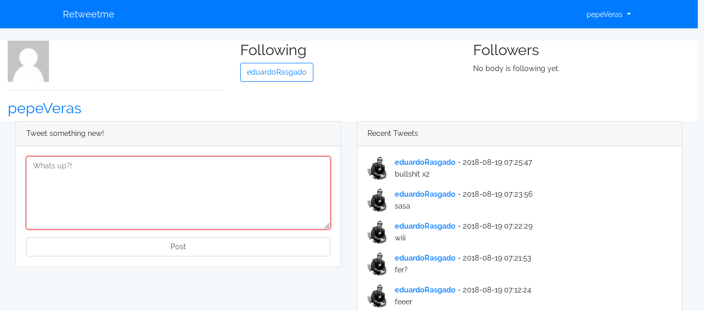

#  Retweet me
Was build with:

The project actually uses too:\
[axios.js Promise based HTTP client ](https://github.com/axios/axios)\
[Pusher Notifications](https://pusher.com/)
[Pusher php sdk](https://github.com/pusher/pusher-http-php)

## What is this?
Retweetme is a mini messages sharing platform like twitter.

## How do I set React with Laravel
Read this:
[Laravel and React JS](https://laravel.com/docs/5.6/frontend#using-react)\
`php artisan preset react`

## How to work with Pusher and Laravel
[Instructions from Pusher](https://pusher.com/tutorials/web-notifications-laravel-pusher-channels)

## How to run to make it yours:
First, start your myql/postgresql service\
Be sure you have created your retweetme database and your credentials on rule.

Run:\
`php artisan make migrations` before running the project\
`php artisan serve` #2 terminal\
`npm run watch` #1 terminal

Now:
1. Open a web browser and open again but in private mode
2. Register 2 or more users and start following each others
3. Now you can tweet something between 2 users which follows each other
4. See the real time each 10 seconds(modify this on App.js component in resources/ asssets if you want)

## License
[MIT license](https://opensource.org/licenses/MIT).
